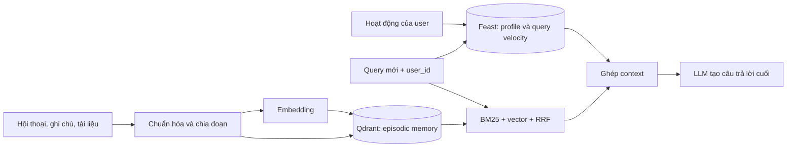

# Hybrid memory cho trợ lý cá nhân tiếng Việt

**Người thực hiện:** Tran Dai Nhan. **Phạm vi:** proof of concept chạy cục bộ, không gọi LLM và không cần API key. `bonus/demo.py` in context sẽ đưa cho LLM nếu triển khai thật. Mỗi kết quả gồm hồ sơ người dùng từ Feast và ký ức liên quan từ Qdrant. Các con số bên dưới là quyết định thiết kế cho POC, không phải cam kết hiệu năng ở production.

## Quyết định 1: chia ký ức theo đoạn văn ngắn

POC nhận ghi chú của một người, tách ở dòng trắng và giới hạn mỗi chunk khoảng 600 ký tự, cắt ở ranh giới từ. Một ghi chú dài có thể thành nhiều điểm Qdrant; payload giữ `user_id` và nguyên văn đoạn để trích dẫn. Kích thước này gần một vài câu, giúp truy vấn cụ thể tìm được ý cần thiết thay vì kéo cả cuộc trò chuyện vào context. Nó cũng giữ một đoạn đủ ngữ cảnh để câu “tự động mở rộng” không bị tách rời “Kubernetes”. Đánh đổi là số vector lớn hơn cách lưu một vector cho cả cuộc hội thoại: tốn dung lượng index, thời gian embed và công sức lọc trùng. Ngược lại, lưu cả cuộc hội thoại trong một vector rẻ hơn nhưng tín hiệu nhiều chủ đề bị trộn; lấy một kết quả có thể tiêu thụ hàng nghìn token context mà vẫn bỏ sót câu cần đọc. Cắt từng tin nhắn thì gọn nhưng dễ mất tham chiếu như “cách đó”. Bản production nên lưu thêm conversation ID, timestamp, source và phạm vi vài câu kề nhau để tái dựng ngữ cảnh. POC chỉ trả tối đa ba chunk trong context, đặt trần cho chi phí prompt.

Với người dùng Việt Nam, câu hỏi có thể trộn tiếng Việt và tiếng Anh: “Kubernetes tự scale lúc traffic tăng”. BM25 dùng `lower().split()` để giữ nguyên thuật ngữ kỹ thuật như `Kubernetes`, còn nhánh vector thử bắt diễn đạt khác. Tokenizer khoảng trắng không xử lý tốt cụm “cơ sở dữ liệu” hay lỗi gõ thiếu dấu. Vì thế hai danh sách được hợp nhất bằng RRF, mỗi rank bắt đầu từ 1 và `k=60`; trong ứng dụng thật cần đánh giá trên bộ câu hỏi tiếng Việt có dấu, không dấu và code switching rồi mới chọn embedding model và tokenizer. Model mặc định của lab thiên về tiếng Anh, nên độ chính xác paraphrase tiếng Việt của POC có giới hạn thật.

## Quyết định 2: hồ sơ dạng bảng trong Feast

Entity là `user_id`. `preferred_language`, `reading_speed_wpm` và `topic_affinity` nằm ở `user_profile_features`, TTL 30 ngày, nguồn là bảng Parquet được materialize sang SQLite ở NB4. `queries_last_hour` nằm ở `query_velocity_features`, TTL 1 giờ; đó là chỉ báo hoạt động gần đây chứ không phải nguyên văn query. Các trường có tên và đơn vị rõ, có thể kiểm tra bằng online lookup và có thể point-in-time join khi huấn luyện. Chúng phù hợp với bảng hơn một latent embedding không giải thích được: để trả lời “người này thích chủ đề nào”, một chuỗi `topic_affinity=cloud` hữu ích và dễ kiểm soát hơn một vector 384 chiều. Đánh đổi là schema bảng thiếu tinh tế khi sở thích có nhiều chủ đề hoặc đổi nhanh. Nếu đo thấy một nhãn chủ đề không đủ, có thể bổ sung `topic_affinity_7d` và phân phối nhiều nhãn; chưa cần thêm một embedding feature view khi POC chỉ có vài hồ sơ tổng hợp.

Feast giữ giá trị gần nhất hợp lệ cho online serving. Với dữ liệu huấn luyện, phải dùng `get_historical_features()` tại timestamp của nhãn. Dùng profile “mới nhất” cho sự kiện cũ sẽ đưa thông tin tương lai vào train, như NB8 minh họa. Một TTL ngắn cho velocity cũng tránh đọc tín hiệu hoạt động đã quá cũ. Nếu lookup hết hạn hoặc user mới chưa có hồ sơ, `recall()` vẫn trả ký ức; profile hiện `{}` và tầng trả lời cần nói rõ chưa có dữ liệu cá nhân hóa.

## Quyết định 3: độ tươi theo ý nghĩa dữ liệu

Ký ức vừa được `remember()` phải truy xuất được ngay sau upsert thành công: đọc tài liệu mới rồi hỏi tiếp là một luồng hội thoại liên tục, chờ năm phút sẽ tạo cảm giác trợ lý quên. Vì vậy path này đồng bộ, trả về khi Qdrant đã ghi điểm. Nó tăng độ trễ của thao tác lưu; có thể chuyển sang hàng đợi nếu đo thấy ghi chậm, nhưng UI lúc đó phải báo trạng thái đang lập chỉ mục. `queries_last_hour` cần cập nhật trong vài giây nếu dùng để phát hiện thay đổi quan tâm hoặc rủi ro; POC sinh dữ liệu batch trong NB4 nên **không** giả vờ đạt độ tươi streaming. Hồ sơ ổn định như ngôn ngữ ưu tiên và tốc độ đọc có thể cập nhật hằng ngày, trừ khi user chủ động đổi cài đặt, khi ấy cần push ngay. Ba nhu cầu có ba cadence khác nhau: tức thì cho ký ức, vài giây cho hành vi ngắn hạn, theo ngày cho thuộc tính ổn định.

Tôi loại bỏ phương án lưu mọi ký ức trong Feast dưới dạng một embedding feature view. Feast mạnh ở lookup theo entity và lịch sử point-in-time, nhưng mỗi user sẽ có nhiều đoạn văn biến động, cần tìm top-K theo độ tương đồng và xóa từng đoạn. Biến nó thành bảng feature sẽ làm phức tạp schema và vẫn cần một index vector thứ hai. Qdrant giữ các đoạn và filter `user_id`; Feast chỉ giữ những giá trị gọn, ổn định hoặc được tổng hợp. Đây cũng cho phép đổi embedding model và lập chỉ mục lại ký ức mà không đổi schema profile.

## Giới hạn và bước tiếp theo

POC dùng Qdrant in-memory; dừng process sẽ mất ký ức. Nó chưa có đăng nhập, mã hóa at rest, xóa dữ liệu, đồng bộ thiết bị, quản lý đồng ý của user, kiểm thử đa tenant ở tầng API, hay pipeline streaming thật cho Feast. Filter `user_id` trong Qdrant là điều kiện cần nhưng chưa đủ: `user_id` phải đến từ danh tính đã xác thực, không được tin chuỗi do client tự gửi. Demo có một ký ức `u_002` để kiểm tra `u_001` không đọc nhầm, song kiểm thử đó không thay thế kiểm thử bảo mật của dịch vụ thật. Bộ nhớ mới cũng chưa có TTL hoặc quy tắc “quên”; cần quyền xóa và chính sách lưu trữ trước khi chứa hội thoại cá nhân thực. LLM trong sơ đồ là bước kiến trúc; code chỉ trả context có thể kiểm tra được, tránh giả tạo một câu trả lời như thể đã gọi model.
